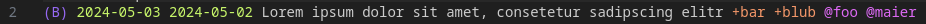
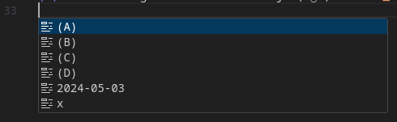
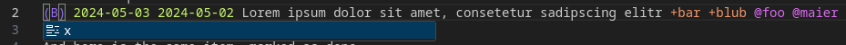
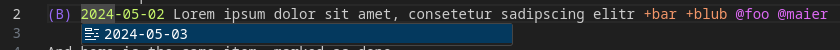

# todo.txt CS
Support for todo.txt format with code completion and auto-timestamping.

Currently the extension is not available in the marketplace, but as .vsix file.
vsix is the [official packaging format](https://code.visualstudio.com/api/working-with-extensions/publishing-extension#packaging-extensions) supported by Visual Studio Code.

[Download latest .vsix file](/release/todotxt-cs-0.0.1.vsix)

For users, to install a .vsix file in VS Code:

1. Go to the Extensions view.
1. Click Views and More Actions...
1. Select Install from VSIX...

# How to use
To initialize a new todo.txt file, you can use the vs code command available by pressing F1 and typing
`TodoTxt: initialize new TodoTxt file`

1. Navigate to a new line.
2. If you want to create a priority or a timestamp, bring up IntelliSense and choose from (A) to (D) or the current date.
Note that you can have 2 dates. By todo.txt convention, the left is the completion and the right the creation date.
(B) 2024-05-03
3. Provide a description for your todo.
(B) 2024-05-03 my todo
4. If you want to tag your todo item, you can do so by providing a context and/ or project tag with + and @
(B) 2024-05-03 my todo +projectA @ContextZ
5. As soon as you want to mark a todo item as done, just preceed the line with an 'x '
And you guessed it: there is IntellySense for 'x '
x (B) 2024-05-03 my todo +projectA @ContextZ

## Features

### Syntax Highlighting

### IntelliSense

### Timestamps

## Release Notes

### 0.0.1

Initial release of the extension as .vsix file

**⊂(◉‿◉)つ**
